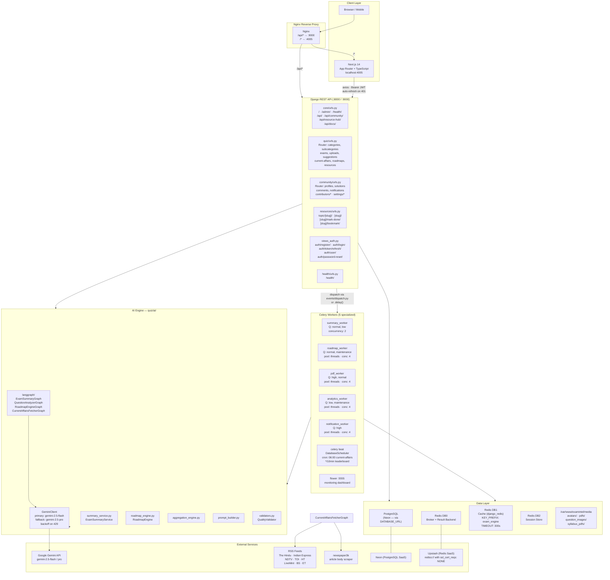
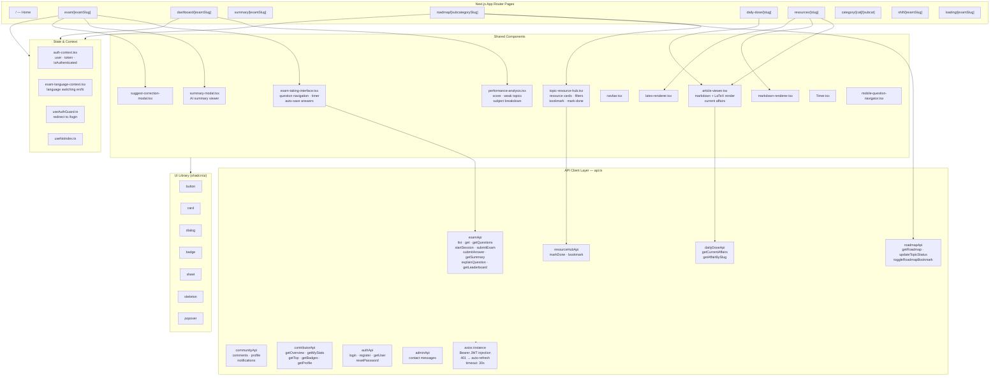
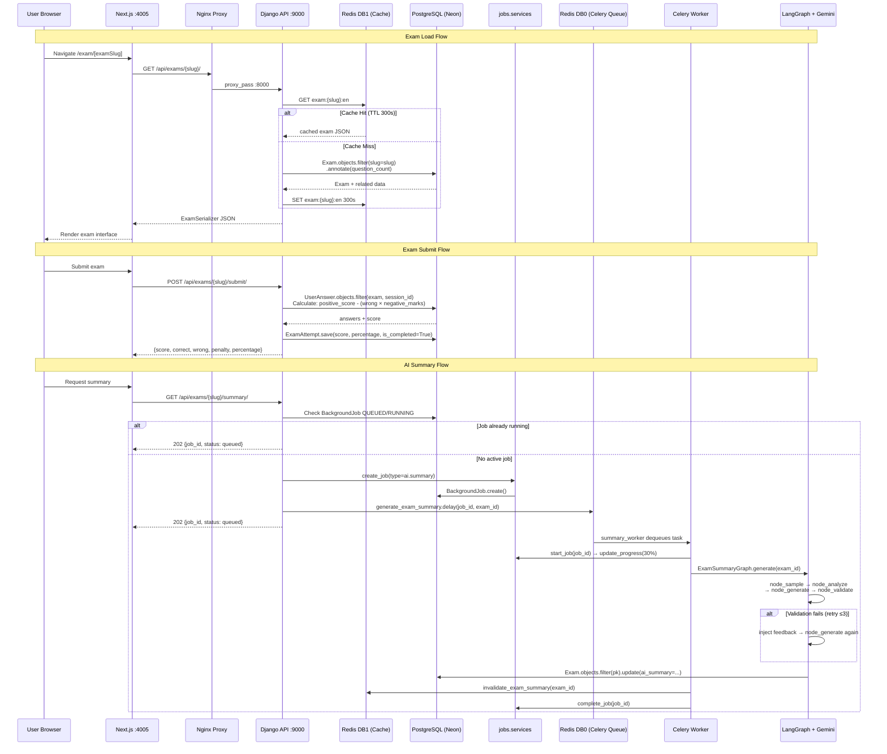
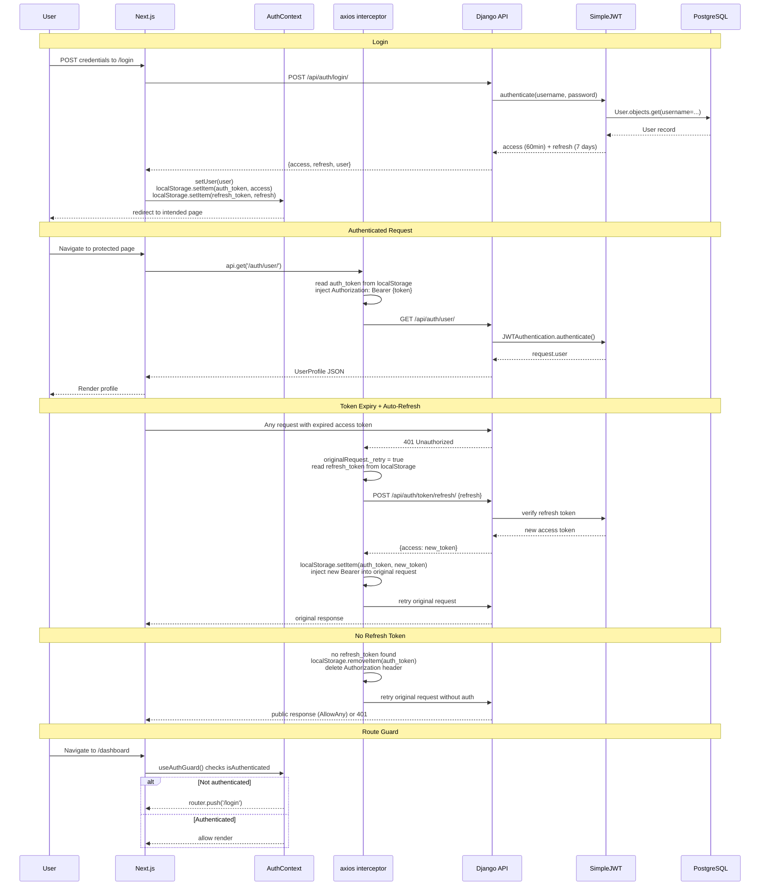
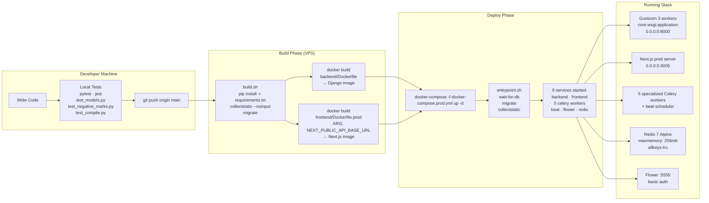

# Project Journey Map 
```markmap
# ExamIntel Engineering Journey
## Phase 1: Discovery & Architecture Design
- Core Problem Identification
  - Manual exam prep and grading loop latency
  - Absence of customized practice resources from raw syllabus PDFs
- Architecture & Stack Selection
  - Frontend: Next.js 14 App Router, TypeScript, Tailwind CSS, Shadcn UI
  - Backend: Django 4.2, Django REST Framework (DRF), Django Signals
  - Data Layer: PostgreSQL (Neon), Redis 7 (broker, cache, session store)
  - AI Orchestration: Google Gemini API, LangGraph

## Phase 2: Ingestion & AI Pipelines
- Document Extraction
  - PyPDF2 text extraction from academic documents
  - 8KB payload chunking for context window management
- Stateful LangGraph Orchestration
  - `QuestionAnalyzerGraph` for batch question categorization
  - `ExamSummaryGraph` with validation retry loop (QualityValidator)
  - `RoadmapEngineGraph` translating syllabus structure to knowledge graphs
  - `CurrentAffairsFetcherGraph` Daily RSS news scraping + AI translation (Hindi)

## Phase 3: Decoupling & Queue Engineering
- Asynchronous Task Queue Setup
  - Celery task framework mapping heavy Gemini calls away from HTTP thread pool
  - Specialized workers (Summary, Roadmap, PDF, Analytics, Notification)
- Concurrency & Lock Management
  - Custom Redis-backed lock manager (`acquire_job_lock`) for task mutual exclusion
  - Telemetry tracking via atomic progress updates (`BackgroundJob` model)
- Django ORM Optimization
  - Eliminating N+1 queries using `select_related` and `prefetch_related`
  - Decoupling heavy XP/reputation ranking triggers into asynchronous loops

## Phase 4: Production Deployment & Observability
- Virtualization
  - Multi-container setup via Docker Compose (Gunicorn, Next.js, Redis, Celery workers)
- Nginx Web Server
  - Reverse proxy configurations routing domain gateways (`api.examintel.in` / `examintel.in`)
  - SSL termination & media files serving
- Observability Dashboard
  - Flower dashboard configuration to monitor worker queue latency, throughput, and retries
```


# Diagram 1: High-Level Architecture


# Diagram 2: Project Structure Mind Map

```markmap
# exam_intel
## frontend (Next.js 14)
### app/
- category/[categorySlug]/[subcategorySlug]
- exam/[examSlug]
- dashboard/[examSlug]
- summary/[examSlug]
- roadmap/[subcategorySlug]
- daily-dose/[slug]
- resources/[slug]
- shift/[examSlug]
- loading/[examSlug]
### components/
- exam-taking-interface.tsx
- performance-analysis.tsx
- topic-resource-hub.tsx
- article-viewer.tsx
- summary-modal.tsx
- markdown-renderer.tsx
- latex-renderer.tsx
### lib/
- api.ts (axios · JWT · auto-refresh)
- apiClient.ts (deprecated fetch wrapper)
- seo.ts
### context/
- auth-context.tsx
- exam-language-context.tsx
### hooks/
- useAuthGuard.ts
- useNoIndex.ts

## backend (Django 4 / DRF)
### core/
- settings.py (4 Celery queues · JWT · Redis · Jazzmin)
- celery.py (beat: 3 schedules)
- urls.py
### quiz/
- models.py (14 models)
- api.py (8 ViewSets + 4 fn views)
- api_summary.py
- api_session.py
- api_dashboard.py
- api_leaderboard.py
- ai/
  - gemini_client.py (fallback · backoff · token logging)
  - langgraph/
    - ExamSummaryGraph (self-correction ≤3)
    - QuestionAnalyzerGraph (batch loop)
    - RoadmapEngineGraph (retry ≤1)
    - CurrentAffairsFetcherGraph (article loop)
  - summary_service.py
  - roadmap_engine.py
  - aggregation_engine.py
  - prompt_builder.py
  - validators.py
- management/commands/
  - fetch_current_affairs.py
  - generate_exam_summary.py
  - generate_roadmap.py
  - import_exam_json.py
### community/
- models.py (Profile · Badge · Solution · Comment · Notification)
- views.py
- signals.py
- services.py
### resources/
- views.py (4 class-based views)
- serializers.py
### tasks/
- summary_tasks.py (generate_exam_summary · generate_topic_explanation)
- roadmap_tasks.py (generate_exam_roadmap · refresh_roadmap_resources)
- pdf_tasks.py
- analytics_tasks.py
- notification_tasks.py
### cache/
- dashboard.py
- leaderboard.py
- roadmap.py
- summary.py
- profile.py
### events/
- dispatch.py (register_handler · dispatch_event)
### jobs/
- models.py
- services.py (create_job · start_job · update_progress · complete_job · fail_job)

## infrastructure
### Docker
- docker-compose.prod.yml (9 services)
- Dockerfile (backend)
- Dockerfile.prod (frontend)
### Deployment
- Nginx (reverse proxy)
- Hostinger VPS
- entrypoint.sh
- build.sh
- Procfile
```

# Diagram 3: Component Architecture



# Diagram 4: API Request Flow




# Diagram 5: Authentication Flow



# Diagram 6: Database ER Diagram

```mermaid
erDiagram
    User {
        int id PK
        string username UK
        string email
        string password
        bool is_staff
        bool is_active
    }
    Category {
        int id PK
        string name
        string slug UK
        string description
        string icon
        int order
        bool is_active
        string icon_color
        string bg_color
    }
    SubCategory {
        int id PK
        int category_id FK
        string name
        string slug UK
        string description
        string icon
        int order
        bool is_active
        file syllabus_pdf
    }
    Exam {
        int id PK
        int subcategory_id FK
        string title
        string slug UK
        text ai_summary
        int year
        string shift
        string status
        file pdf_file
        int duration_minutes
        int total_questions
        decimal marks_per_question
        decimal negative_marks
        int total_marks
        bool is_active
        json supported_languages
    }
    Question {
        int id PK
        int exam_id FK
        text question_text
        image image
        bool is_image_based
        string question_type
        int order
        int marks
        json metadata
        text explanation
        string subject
        string topic
        string difficulty
    }
    Answer {
        int id PK
        int question_id FK
        text answer_text
        bool is_correct
        int order
    }
    UserAnswer {
        int id PK
        int exam_id FK
        int question_id FK
        int selected_answer_id FK
        text text_answer
        bool is_correct
        string session_id
        bool is_flagged_for_review
        bool is_bookmarked
    }
    ExamAttempt {
        int id PK
        int user_id FK
        int exam_id FK
        float score
        int total_questions
        int correct_answers
        float percentage
        string session_id
        int duration
        bool is_completed
        int current_question_index
        string guest_name
        string guest_email
    }
    PracticeSession {
        int id PK
        int user_id FK
        int exam_id FK
        float score
        float accuracy
        string session_id
        int duration
        bool is_completed
        int current_question_index
        bool is_paused
    }
    CurrentAffair {
        int id PK
        int category_id FK
        string title
        string slug UK
        text content
        text summary
        string source_name
        string source_url
        date published_date
    }
    ExamRoadmap {
        int id PK
        int subcategory_id FK
        string title
        text description
    }
    RoadmapPhase {
        int id PK
        int roadmap_id FK
        string title
        text description
        int order
    }
    RoadmapTopic {
        int id PK
        int phase_id FK
        string title
        string slug UK
        text description
        int estimated_minutes
        int order
        json resources
    }
    UserTopicProgress {
        int id PK
        int user_id FK
        int topic_id FK
        string status
        datetime completed_at
    }
    ResourceTag {
        int id PK
        string name UK
        string slug UK
        string color
    }
    TopicResource {
        int id PK
        int topic_id FK
        int created_by_id FK
        string title
        string slug UK
        string resource_type
        string content_format
        text markdown_content
        text html_content
        text latex_content
        string external_url
        int estimated_read_minutes
        string difficulty
        int order
        bool is_featured
        bool is_published
        bool is_ai_generated
        text ai_summary
        int view_count
    }
    ResourceProgress {
        int id PK
        int user_id FK
        int resource_id FK
        bool is_completed
        datetime last_viewed_at
    }
    ResourceBookmark {
        int id PK
        int user_id FK
        int resource_id FK
        datetime bookmarked_at
    }
    Profile {
        int id PK
        int user_id FK
        string avatar_char
        image avatar_image
        text bio
        int xp
        int streak
        int best_streak
        int total_solutions
        int total_comments
        int total_upvotes_received
        float reputation_score
        int community_rank
        float percentile
    }
    Badge {
        int id PK
        string name UK
        string slug UK
        string description
        string icon
        string criteria_type
        int criteria_value
        bool is_active
    }
    UserBadge {
        int id PK
        int user_id FK
        int badge_id FK
        datetime awarded_at
    }
    Solution {
        int id PK
        int user_id FK
        int question_id FK
        text content
        int upvotes
        int views
        bool is_ai_generated
        bool ai_verified
    }
    SolutionUpvote {
        int id PK
        int solution_id FK
        int user_id FK
    }
    Comment {
        int id PK
        int user_id FK
        int question_id FK
        int solution_id FK
        int parent_id FK
        text text
        int upvotes
    }
    CommentUpvote {
        int id PK
        int comment_id FK
        int user_id FK
    }
    Notification {
        int id PK
        int user_id FK
        string type
        string title
        text message
        bool is_read
    }
    ContributorActivity {
        int id PK
        int user_id FK
        string activity_type
        string description
        json metadata
    }
    UserSettings {
        int id PK
        int user_id FK
        int primary_exam_id FK
        string preferred_language
        int daily_study_goal
        bool notify_exam_results
        string theme
        bool is_public_profile
    }
    QuestionPaperUpload {
        int id PK
        int user_id FK
        int category_id FK
        string subject
        date exam_date
        file file
        string status
    }
    CorrectionSuggestion {
        int id PK
        int user_id FK
        int question_id FK
        string type
        json suggestion_data
        string status
        int upvotes
    }
    ContactMessage {
        int id PK
        string name
        string email
        text message
        string status
    }

    Category ||--o{ SubCategory : has
    SubCategory ||--o{ Exam : contains
    SubCategory ||--o| ExamRoadmap : has
    Exam ||--o{ Question : has
    Question ||--o{ Answer : has
    Question ||--o{ UserAnswer : answered_in
    Question ||--o{ CorrectionSuggestion : has
    Question ||--o{ Solution : has
    Question ||--o{ Comment : has
    Exam ||--o{ UserAnswer : tracks
    Exam ||--o{ ExamAttempt : produces
    Exam ||--o{ PracticeSession : produces
    User ||--o{ ExamAttempt : takes
    User ||--o{ PracticeSession : takes
    User ||--o{ UserAnswer : submits
    ExamRoadmap ||--o{ RoadmapPhase : has
    ExamRoadmap }o--o{ User : bookmarked_by
    RoadmapPhase ||--o{ RoadmapTopic : has
    RoadmapTopic }o--o{ RoadmapTopic : prerequisites
    RoadmapTopic ||--o{ TopicResource : has
    RoadmapTopic ||--o{ UserTopicProgress : tracked_by
    TopicResource }o--o{ ResourceTag : tagged
    TopicResource ||--o{ ResourceProgress : tracked_by
    TopicResource ||--o{ ResourceBookmark : bookmarked_by
    User ||--o| Profile : has
    User ||--o| UserSettings : has
    User ||--o{ UserBadge : earns
    Badge ||--o{ UserBadge : awarded_as
    User ||--o{ Solution : posts
    Solution ||--o{ SolutionUpvote : receives
    Solution ||--o{ Comment : has
    Comment ||--o{ Comment : replies_to
    Comment ||--o{ CommentUpvote : receives
    User ||--o{ Notification : receives
    User ||--o{ ContributorActivity : generates
    Category ||--o{ CurrentAffair : categorizes
    User ||--o{ QuestionPaperUpload : uploads
    Category ||--o{ QuestionPaperUpload : tagged
```




# Diagram 7: CI/CD Pipeline



# Diagram 8: Deployment Architecture

```mermaid
graph TB
    subgraph Internet["Internet"]
        Client["Client Browser"]
    end

    subgraph VPS["Hostinger VPS (Ubuntu)"]
        Nginx["Nginx<br/>SSL Termination<br/>api.examintel.in → :9000<br/>examintel.in → :4005<br/>Serves /media/ static files"]

        subgraph DockerNet["Docker Network (docker-compose.prod.yml)"]
            subgraph AppServices["Application Services"]
                BackendC["backend<br/>Django + Gunicorn<br/>127.0.0.1:9000→:8000<br/>3 workers"]
                FrontendC["frontend<br/>Next.js prod<br/>127.0.0.1:4005→:4005<br/>NODE_ENV=production"]
            end

            subgraph CeleryServices["Celery Services"]
                SummaryWC["summary_worker<br/>Q: normal,low<br/>concurrency: 2"]
                RoadmapWC["roadmap_worker<br/>Q: normal,maintenance<br/>threads · conc: 4"]
                PDFWC["pdf_worker<br/>Q: high,normal<br/>threads · conc: 4"]
                AnalyticsWC["analytics_worker<br/>Q: low,maintenance<br/>threads · conc: 4"]
                NotifWC["notification_worker<br/>Q: high<br/>threads · conc: 4"]
                BeatC["beat<br/>DatabaseScheduler"]
                FlowerC["flower<br/>127.0.0.1:5555→:5555<br/>admin:Admin@examintel123"]
            end

            RedisC["redis:7-alpine<br/>DB0: broker+results<br/>DB1: cache (256mb, allkeys-lru)<br/>DB2: sessions<br/>volume: redis_data"]
        end

        subgraph Volumes["Docker Volumes"]
            MediaMount["/var/www/examintel/media<br/>shared by backend + all workers"]
            StaticVol["django_prod_static<br/>served by Nginx via whitenoise"]
        end
    end

    subgraph CloudServices["Cloud Services (External)"]
        NeonDB["Neon PostgreSQL<br/>DATABASE_URL env var<br/>conn_max_age: 600<br/>health_checks: true"]
        UpstashRedis["Upstash Redis (optional)<br/>rediss:// SSL<br/>ssl_cert_reqs: NONE"]
        GeminiAPI["Google Gemini API<br/>gemini-2.5-flash (primary)<br/>gemini-2.5-pro (fallback)"]
        RSSFeeds["RSS Feeds<br/>8 Indian news sources"]
    end

    Client -->|HTTPS| Nginx
    Nginx -->|"/api/* · /admin/* · /health/*"| BackendC
    Nginx -->|"/*"| FrontendC
    BackendC --> NeonDB
    BackendC --> RedisC
    CeleryServices --> RedisC
    CeleryServices --> NeonDB
    BackendC -->|"AI calls"| GeminiAPI
    CeleryServices -->|"AI tasks"| GeminiAPI
    BeatC -->|"06:00 daily"| SummaryWC
    SummaryWC -->|"fetch_current_affairs"| RSSFeeds
    BackendC --- MediaMount
    CeleryServices --- MediaMount
```




